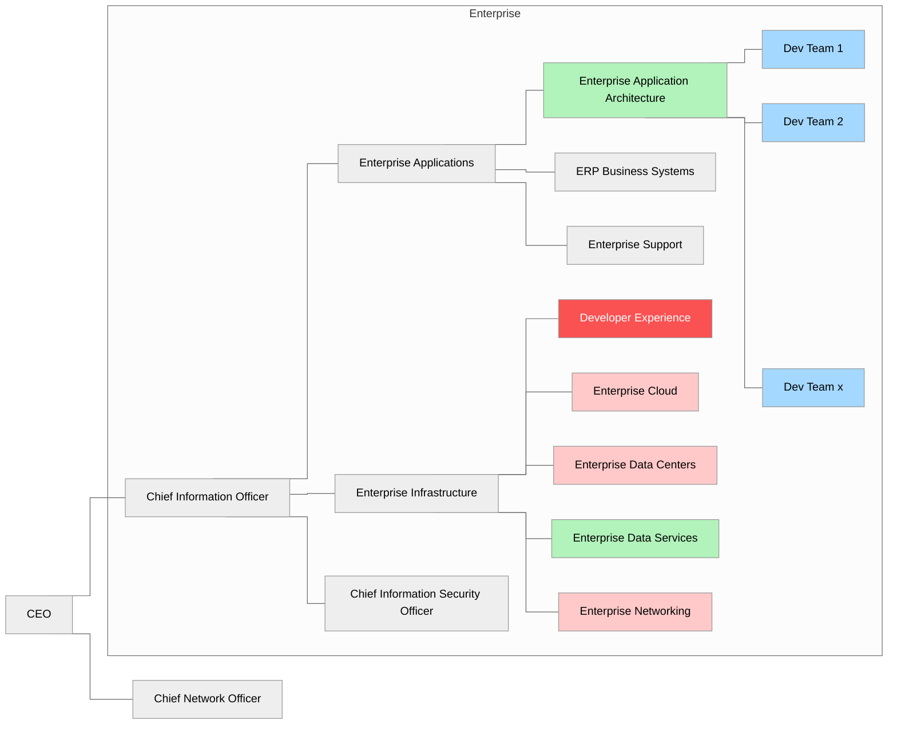
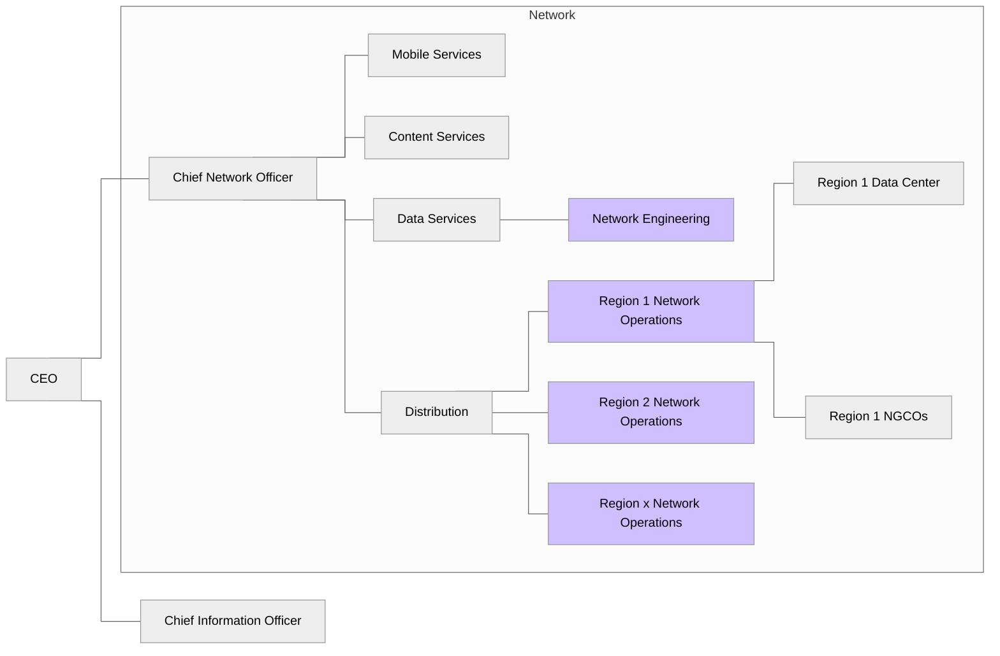
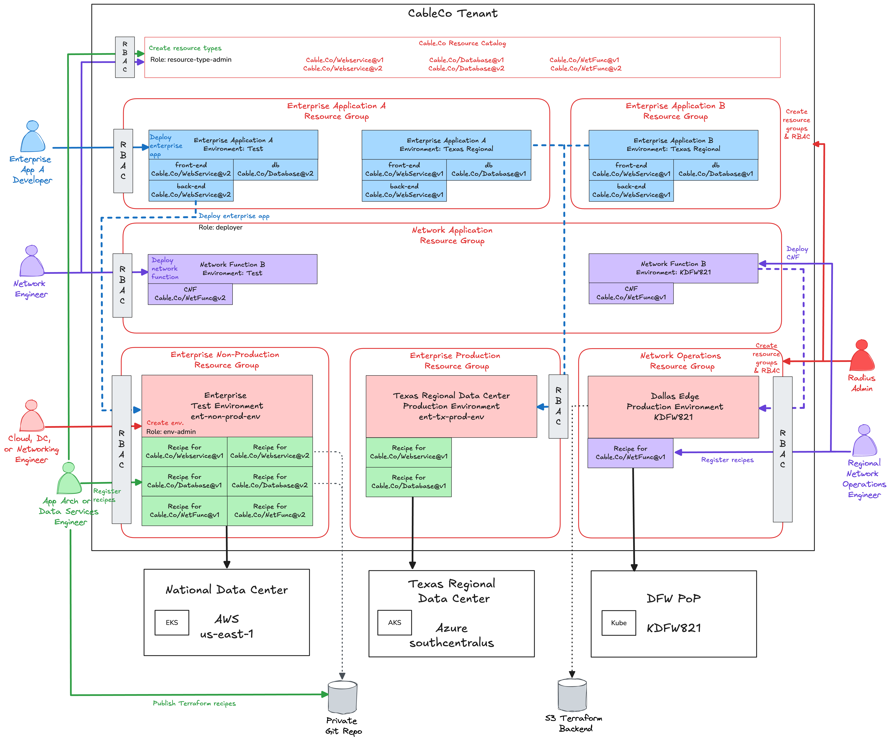

# **CableCo Background and Radius Deployment** 

The goal of this document is to examine a complex enterprise and envision how Radius would support their organization and workflows. The intention is to bottom out Radius requirements specific to CableCo then to generalize those for all enterprises in a separate, CableCo-agnostic, document.

What follows is a description of a fictional enterprise company based on multiple actual organizations. A significant number of details are inferred and are not indicative of a specific organization.

## CableCo Background

CableCo is a national cable company in the United States. They offer cable television, residential and commercial internet access in 41 states, and mobile telephone service as an MVNO nationwide. CableCo has been on a multi-year journey to modernize all aspects of their operations to use cloud-native technologies. 

### Organizational Structure

CableCo has a highly capable engineering team organized in two separate organizations. 

#### Enterprise

The Enterprise team is led by CableCo's CIO. It is a traditional enterprise IT organization who manages applications for running the business. The Enterprise Application Team is aligned with business units and build and operate applications which perform a wide variety of business functions including customer care, billing, and payment processing. It is split into three organizations: (1) Enterprise Application who is responsible for in-house developed applications and custom extensions to commercial software; (2) ERP Business Systems which is responsible for configuring and maintaining commercial ERP-style applications; and (3) Enterprise Support which provides 24x7 support services for all Enterprise applications.

The Enterprise Infrastructure team is responsible for all infrastructure services for the Enterprise team. This includes cloud services, data centers, DBAs and data management, networking, and the developer experience team.

In the context of Radius, there are three groups which constitute the personas in Radius:

1. **Developer Experience** – The platform engineering team maintains the internal developer platform, operates their CI/CD system, and other shared services for developers. 
2. **Enterprise Cloud and Enterprise Data Center** – These are shared service teams who will manage the infrastructure environments.
3. **Enterprise Application Architecture and Enterprise Data Services **– These are shared service teams who manage reusable application components and databases.
4. **Development Teams** – Application developers who will use Radius resource types to build and deploy their applications.

#### Network

The Network team is a separate group who manages the entire CableCo network. This includes service provisioning, service metering, and network operations. The Network team manages hardware and software deployed in regional data centers, cloud providers, and in thousands of CableCo edge points of presence across the country. Network applications are used to actually run CableCo's network. These are called network functions. Network functions can be containerized network functions (CNFs) which run on Kubernetes or virtualized network functions (VNFs) which run inside OpenStack virtual machines, but CableCo will only use Radius with the newer CNFs.

The two groups who interact with Radius are the Network Engineering team who is responsible for configuring and testing containerized network functions. They will maintain the resource types for CNFs, the network test environments for CNFs. The second group is each regional network operations team who will manage the recipes for each NGCO environment and deploy the CNFs.

## Enterprise Application Classification

CableCo's enterprise application portfolio is broad and includes simple, internal HR applications, more complex ERP-style applications, to complex network management applications. Given the breadth, CableCo classifies their enterprise applications across two dimensions: business criticality and deployment type.

Business criticality options include:

- **Prime** – The top five most critical applications within the company. An outage of a prime application has an existential risk to the business. The RTO is 5 minutes with an RPO of 0 minutes. Each prime application will have multiple development, functional test, and integration test environments. The staging environment is a mirror image of the production environment.

- **Critical** – Business critical applications. These applications support ongoing business operations. The RTO is 1 hour with an RPO of 15 minutes. There are 10–20 critical applications within CableCo's application portfolio.

- **Enterprise** – Applications which support a recurring business process but are not critical to the daily operations of the company; e.g., they may support a weekly or monthly business process. The RTO is 1 business day with an RPO of 1 business day. There are 50–100 enterprise applications within CableCo's application portfolio. All testing environments are classified as enterprise applications.

- **Maintenance** – Applications with minimal utility within the company. These applications are not being upgraded or enhanced and are only in maintenance mode, akin to being deprecated. Maintenance applications are deployed in a single availability zone (AZ) with limited high availability beyond simple backups. There is no RTO but have an RPO of 3 business days. There are hundreds of maintenance applications within CableCo's application portfolio. All development environments are classified as maintenance.

Deployment types include:

- **Multi-region** – Multi-region applications are deployed across multiple AZs and multiple regions for the highest availability and lowest client latency. Multi-region applications are complex and difficult to manage. Rather than failing over to another region, multi-regional applications are resilient to a regional outage and will automatically route ingress traffic to another region with consistent data across regions.CableCo maintains a managed network which provides a logical unicast IP address for ingress. Dependent upon the client's location, the network routes the request to the nearest region for that client. Ingress traffic flows to a regional load balancer then to the individual pods managed by a multi-AZ Kubernetes cluster. Databases are replicated within the region and across regions.

- **National** – National applications are a simplified version of multi-region deployments but are only to CableCo's primary cloud region in AWS. These applications run across multiple AZs with automatic failover during an AZ outage, or have automated disaster recovery, dependent upon the application architecture. The majority of CableCo's applications are national.

- **Regional** – Regional applications are similar to national applications but are deployed to a single region of the country to support network operations in one of CableCo's 25 operating regions. These regions run on a mix of AWS, Azure, and CableCo-owned data centers. 

- **Edge** – Edge applications are to one of CableCo's 1,500 next-generation central office (NGCO) locations, which are used to operate CableCo's network as well as to provide edge compute capabilities for CableCo's businesses and customers. These are also referred to as points of presence or edge locations. For network functions, CableCo uses a blue/green deployment methodology starting with a single edge location then gradual rollout site-by-site with increasing frequency. The benefit of edge locations is that all edge applications are non-persistent. Any data they capture is shipped to a regional or national application.

## CableCo Challenges

**Application Deployments** – Rolling out application updates must be carefully orchestrated. CableCo performs canary deployments in a single region. CableCo has configured ingress controllers on each Kubernetes cluster. They then deploy a separate instance of the application (a separate Kubernetes deployment and service) and reconfigure the ingress controller to route a percentage of traffic to the canary service. The actual ingress controller used depends upon the underlying infrastructure. AWS regions use AWS Application Load Balancers, Azure regions use AKS Application Gateway, and on-premises use nginx. Once the canary has been validated, a blue/green deployment is made region by region then the canary is torn down.

**Infrastructure Software Updates** – There is a continual pipeline of software updates to deploy which are not related to the application. The application base container images, Kubernetes control plane, multiple Kubernetes controllers and extensions, operating systems, etc. all must be maintained. For infrastructure hosting prime and critical applications, infrastructure changes are rolled out in a similar fashion to application deployments. The CableCo platform team must collaborate with the application teams to perform a release which contains only infrastructure changes. The changes flow through the same development, functional test, integration test, stage, then production deployments. Production deployments are blue/green region by region.

**New Applications** – Rolling out new applications is difficult organizationally because many components are managed by central teams. DNS and the unicast IP ingress are managed by the outbound network team. Vnet setup is managed by the cloud network team. Kubernetes is bundled with prime and critical applications, but lower tiered applications run on shared clusters managed by the cloud infrastructure team. The same is true for databases with the DBA team. The DBAs are also responsible for data replication and backup.

**Edge Locations** – The challenge with edge applications is the number of locations. CableCo must have automated deployment tools which not only deploy the application and any infrastructure software updates, but also verifies the success of updates.

## Envisioned Radius Deployment

CableCo wants to use Radius as their deployment orchestrator as part of their internal development platform. The diagram below is what CableCo is envisioning.

CableCo will deploy Radius as a single tenant running in a single Radius control plane. The Radius administrator will only create resource groups and configure RBAC. He or she will create resource groups for applications and application resources along with RBAC rules which define which developers can deploy, update, or delete applications and application resources. He or she will also create resource groups for environments and recipes. RBAC rules will be added which grant the ability to setup environments to the Enterprise Cloud, Enterprise Data Center, and Enterprise Networking teams. Separately, RBAC rules will be created granting access to manage recipes to the Enterprise Application Architecture and Enterprise Data Services teams.

An engineer from the Enterprise Cloud or Enterprise Data Center teams will create environments in one of the environment resource group. Data center environments will only have credentials to a Kubernetes cluster running in that data center. Cloud environments will have credentials to AWS, Azure, or Google Cloud and will be configured to use Kubernetes, ACA, ACI, ECS, or CloudRun as the compute runtime environment. Some environments will be application/location specific and others will be shared across multiple applications and teams. Each environment will have RBAC rules defining which development tams can deploy applications into that environment.

Engineers from the Enterprise Application Architecture team and the Enterprise Data Services teams are responsible for managing the resource types and recipes in each Enterprise environment. CableCo uses Terraform as their Infrastructure as Code tool and stores them in a on-premises Git repository.

Each enterprise application development team will have their own resource group with RBAC rules limiting access to the applications and resources within that resource group. Each enterprise application development team will have access to deploy their applications to certain environments in other resource groups. Since recipes are in the environments' resource group, they only have the ability to use whichever resource types have a recipe in the environment to which they have access to and are deploying their application.

The network engineering team is split between network engineers who configure and test network functions and regional network operations teams who manage the network regionally.
