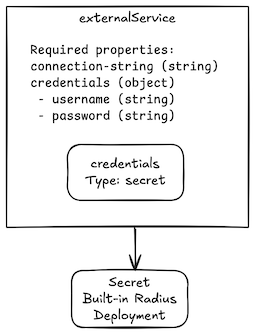

# Feedback on User-Defined Resource Types


## Reference Application – Simple eShop

Our reference application is an online store. It is a simplified version of the [eShop Radius sample](https://github.com/radius-project/samples/tree/v0.39/samples/eshop). The application has two micro services, frontend and backend, and three databases for orders, customer, and products. The backend service has external connections for processing payments via Stripe and sending emails and text messages via Twilio.

In the diagram below, the Simple eShop has been modeled using Radius resource types. Notice that some resources are part of the Simple eShop application while others are shared resources. These shared resources reside within the same environment but are next to, not embedded in the Simple eShop application. These shared resources can be connected to by any application deployed in the same environment.


## Use Cases 1 – User-defined resource type deployed via a recipe

The first use case is the simplest. It is a user-defined resource type, defined by a custom API, backed by a recipe—either Terraform or Bicep. In this example, a PostgreSQL database is modeled. There are three types of properties: required, optional, and read-only. Required and optional properties are input parameters while read-only properties are output parameters set by the deployment engine.

 

We envision modeling this resource type using YAML:

`````yaml
---
namespace: MyCompany.App
resourceTypes: 
  postgreSQL:
    metadata:
      description: A postgreSQL database
    apiVersions:
      # See question 2
      'v1alpha1':
        schema: 
          type: object
          properties:
            size:
              type: string
              description: The size of database to provision
              enum:
              - S
              - M
              - L
              - XL
            connectionString:
              type: string
              # Set via an output from a recipe
              # Readable in the application definition Bicep file
              readOnly: true
              description: Fully qualified string to connect to the resource
            credentials:
              type: object
              readOnly: true
              properties:
                username:
                  type: string
                  description: username for the database
                password:
                  type: string
                  description: password for the database user
          required:
            # Cannot be read-only properties
            - size
`````

### Question 1 – Initial feedback on this resource type definition format?

### Question 2 – Do you have feedback on API versioning?

Azure resource APIs are versioned using a data such as `2023-10-01-preview`. Kubernetes APIs are versioned using `v1alpha1`, `v1beta1`, `v1`, etc.

Should Radius enforced a particular versioning scheme?

Should the apiVersion field simply be a string?

Any other constraints or validations?

## Use Case 2 – Developer Documentation

The resource catalog needs to be browsable by developers. We envision developers being able to inspect resource types via the CLI and via the Radius dashboard. First, platform engineers would annotate the resource type definition with developer documentation such as:

`````yaml
---
namespace: MyCompany.App
resourceTypes: 
  postgreSQL:
  	metadata:
      long-name: MyCompany PostgreSQL Database
      description: | 
        The MyCompany.App/postgreSQL@v1alpha1 resource type
				is a standard configuration relational database configured with 
				corporate security settings enforced. |
      example: |
        ... |
			change-log: |
        ... |
    apiVersions:
      # See question 2
      'v1alpha1':
        schema: 
          type: object
          properties:
            size:
              type: string
              description: |
                The size of database to provision
                  - 'S': 0.5 vCPU, 2 GiB memory, 20 GiB storage
                  - 'M': 1. vCPU, 4 GiB memory, 40 GiB storage
                  - 'L': 2.0 vCPU, 8 GiB memory, 60 GiB storage
                  - 'XL': 4.0 vCPU, 16 GiB memory, 100 GiB storage |
              enum:
              - S
              - M
              - L
              - XL
            connection-string:
              type: string
              # Set via an output from a recipe
              # Readable in the application definition Bicep file
              readOnly: true
              description: Fully qualified string to connect to the resource
            credentials:
              type: object
              readOnly: true
              properties:
                username:
                  type: string
                  description: The username for the database
                password:
                  type: string
                  description: The password for the database user
          required:
            # Cannot be read-only properties
            - size
`````

Then the developer can:

```yaml
# List all resource types
rad resource-type list
NAMESPACE                RESOURCE TYPE
MyCompany.App            postgreSQL
MyCompany.App            service
MyCompany.Net            gateway
```

```yaml
# List all resource types filtering by namespace
rad resource-type list --namespace MyCompany.App
NAMESPACE                RESOURCE TYPE
MyCompany.App            postgreSQL
MyCompany.App            services
```

```yaml
# Show details of a resource type
rad resource-type show MyCompany.App/postgreSQL
NAMESPACE                MyCompany.App
RESOURCE TYPE            postgreSQL
VERSION                  v1alpha1
DESCRIPTION
  The MyCompany.App/postgreSQL@v1alpha1 resource type
  is a standard configuration relational database configured with 
  corporate security settings enforced.
REQUIRED PROPERTIES
  * size (string)
    The size of database to provision
		  - 'S': 0.5 vCPU, 2 GiB memory, 20 GiB storage
		  - 'M': 1. vCPU, 4 GiB memory, 40 GiB storage
		  - 'L': 2.0 vCPU, 8 GiB memory, 60 GiB storage
		  - 'XL': 4.0 vCPU, 16 GiB memory, 100 GiB storage
OPTIONAL PROPERTIES
READ-ONLY PROPERTIES
  * connection-string (string) Fully qualified string to connect to the resource
  * credentials.username (string) The username for the database
  * credentials.password (string) The password for the database user
ENVIRONMENT VARIABLES
...
EXAMPLE
...
```

### Question 3 – Any feedback on the metadata fields and the CLI output?

## Use Case 3 – Using Properties

When you author a user-defined resource type, the resource will have required properties, optional properties, and read-only properties. The required and optional properties are input parameters when creating the resource. The read-only properties are output parameters set by the deployment engine and the recipe.

### Question 4 – When a connection is added from a container to this resource, how should read-only property values be injected into the application?

#### Option A – Environment variables specified in the application definition by the developer

**`simple-Eshop.bicep`**

`````diff
resource ordersDB 'MyCompany.App/postgreSQL@v1alpha1' = {
  name: 'ordersDB'
  properties: {
     size: 'M' 
  }
}

resource backend 'Applications.Core/containers@2023-10-01-preview' = {
  name: 'backend'
  properties: {
    container: {
      image: 'simple-eshop-backend:latest'
      connections: {
      ordersDB: {
        source: ordersDB.id
      }
    }
    # This is possible today
+    env:{
+     ORDERS_DB_CONNECTION_STRING: {
+          value: ordersDB.connectionString
+      }
+      ORDERS_DB_USERNAME: {
+        value: ordersDB.credentias.username
+      }
+      ORDERS_DB_PASSWORD: {
+        value: ordersDB.credentias.password
+      }
    }
}
`````

#### Option B – Environment variables specified in resource type definition by the platform engineer, overridable by the developer

In this case, default environment variables are specified in the resource type definition. Radius then automatically injects these variables into any connected container. System-defined resource types automatically inject pre-defined environment variables today (see [Redis](https://docs.radapp.io/reference/resource-schema/cache/redis/#environment-variables-for-connections) as an example).

**`postgreSQL-resource-definition.yaml`**

`````diff
postgreSQL:
  description: A postgreSQL database
  apiVersions:
    'v1alpha1':
      schema: 
        type: object
        properties:
          size:
            type: string
            description: The size of database to provision
            enum:
            - S
            - M
            - L
            - XL
          connectionString:
            type: string
            readOnly: true
            description: Fully qualified string to connect to the resource
             # Set by the platform engineer. Can also be overridden using the method in Option A
+            env-variable: POSTGRESQL_CONNECTION_STRING
          credentials:
            type: object
            readOnly: true
            properties:
              username:
                type: string
                description:
+                env-variable: POSTGRESQL_USERNAME
              password:
                type: string
                description:
+                env-variable: POSTGRESQL_PASSWORD
        required:
          - size
`````

### Question 5 – Do properties need data validation?

We envision needing to have data validation on all writable parameters. It doesn't apply in the PostgreSQL example, but here is an alternative example of using a regular expression to validate a property value.

```yaml
# Technical example only; bad use case
properties:
  - cidr-block
    type: string
    description: CIDR block in the form of "10.1.1.0/24"
    # Validate proper CIDR notation
    regex: ^([0-9]{1,3}\.){3}[0-9]{1,3}($|/([1-9]|[12][0-9]|3[012]))$
    required: true
```

Is data validation on properties required? If so, what is the relative priority?

## Use Cases 4 – Connecting to shared resources 

Shared resources are resources maintained by either the platform engineering team or another non-application team. Most examples are all shared storage resources of some kind; a shared database server as the most common example. 

In the example above, there are two databases which are shared across applications in the environment. The customersDB and productsDB would be deployed along with the environment, but not tied to an application.

**`production-environment.bicep`**

`````diff
resource environment 'Applications.Core/environments@2023-10-01-preview' = {
  name: 'production'
  properties: {
    ...
  }
}

# Note that there is no application property
resource customersDB 'MyCompany.App/postgreSQL@v1alpha1' = {
  name: 'customersDB'
  properties: {
+    environment: production
    size: L
}

# Note that there is no application property
resource productsDB 'MyCompany.App/postgreSQL@v1alpha1' = {
  name: 'productsDB'
  properties: {
+    environment: production
    size: L
}
`````

Then the application can create connections to those resources in the environment.

**`simple-Eshop.bicep`**

`````yaml
# Existing resource in the resource group
resource customersDB 'MyCompany.App/postgreSQL@v1alpha1' = existing {
  name: 'customersDB'
}

# Existing resource in the resource group
resource productsDB 'MyCompany.App/postgreSQL@v1alpha1' = {
  name: 'productsDB'
  # If in another resource group
  # scope: resourceGroup(exampleRG)
}

resource backend 'Applications.Core/containers@2023-10-01-preview' = {
  name: 'backend'
  properties: {
    container: {
      image: 'simple-eshop-backend:latest'
      connections: {
        customersDB: {
          source: customersDB.id
        }
        productsDB: {
          source: productsDB.id
        }
      }
  ...
}
`````

### Question 6 – What is your feedback on the shared resource use case?

Do you have this use case?

How common would it be in a multiple application Radius environment?

Would you use this capability early in your adoption of Radius or much later? It is assumed that this capability is not required for the first Radius-managed application.

## Use Case 5 – Connecting to external services

In the Simple eShop application, the backend service connects to Stripe for payment processing and Twilio to send emails and text messages. The simplest approach for managing the connection details and credentials for these external services is to set these value manually within the application definition.

Alternatively, the platform engineer, or environment manager can model these external services as resources. The benefits of modeling external services this way is twofold. First is that the developer can easily get environment-specific external service details. In fact, the developer would only need to create the connection in their application definition then environment variables would automatically be injected into the container. Second, the connection to the external service will show in the application graph. 

  

In this case, the external services would be similar to connecting to shared services. However, the key difference is that the external service resource does not have a deployed resource. It is simply metadata which is available for applications within an environment to consume.

Here is an example of an environment with a Twilio external service resource.

**`production-environment.bicep`****

```yaml
extension radius

resource environment 'Applications.Core/environments@2023-10-01-preview' = {
  name: 'production'
  properties: {
    ...
  }
}

var twilio-account-sid = 'ACXXXXXXXXXXXXXXXXXXXXXXXXXXXXXXXX'
var twilio-username = 'simpleEshop-twilio-prod-user'
var twilio-password = 'o84nouvTiHWiw97sbq6B'

resource twilio 'MyCompany.App/externalService@v1alpha1' = {
  name: 'twilio'
  properties: {
    environment: production
    connection-string 'https://api.twilio.com/2010-04-01/Accounts/${twilio-account-sid}'
    credentials:
      username: ${twilio-username}
      password: ${twilio-password}
}
```

And here is a container with a connection to Twilio. Environment variables would automatically be injected into the container would as shown in use case 2, option B.

`````yaml
# Existing resource in the resource group
resource twilio 'MyCompany.App/externalService@v1alpha1' = existing {
  name: 'twilio'
}

resource backend 'Applications.Core/containers@2023-10-01-preview' = {
  name: 'backend'
  properties: {
    container: {
      image: 'simple-eshop-backend:latest'
      connections: {
        twilio: {
          source: twilio.id
        }
  ...
}
`````

### Question 7 – Would you prefer to model external services as resources or manage them manually?

## Use Case 6 – User-defined resource type with embedded system-defined resource

In this use case, a user-defined resource type is created such as the external service from the previous use case. This time, however, the resource type has an another embedded resource. In the external service example, this is a secret, which is a Radius system-defined resource type meaning Radius knows how to deploy these resource types. Therefore, a Terraform or Bicep recipe is not required. Other system-defined resource types include containers, gateways, volumes, and others.

 

### Question 8 – Would you want to use a system-defined resource type from within a user-defined resource type?

 Is this a valid use case, and if so, how high a priority is this use case? 

Would you use this pattern in the first application you deployed with Radius?

How valuable is the benefit of using a system-defined resource type and its built-in deployment logic over simply using a recipe as in the previous example?

The alternative to this capability is referencing two existing resources in the app.bicep file—one for the external service which has the connection string, and another for the secret. This sounds acceptable, but extrapolating this use case out to more complex examples, this approach starts to break down. See use case 7 for a more complex use case.

### Question 9 – For this use case, how would you prefer to model this resource type?

#### Option A – YAML

The benefit of using YAML is that it is generally easier to use with greater awareness. However, the syntax of a resource being inside a resource type definition is awkward in YAML.

````yaml
---
namespace: MyCompany.App
resourceTypes: 
  externalService:
    description: A connection to a service not managed by Radius
    apiVersions:
      'v1alpha1':
        schema: 
          type: object
          properties:
            connectionString:
              type: string
              description: Fully qualified string to connect to the resource
            credentials:
              type: object
              properties:
                username:
                  type: string
                  description: The username for the external service
                password:
                  type: string
                  description: The password for the external service user
          required:
            - connectionString        
    # Child resource
    resources:
      - resource credentials 'Applications.Core/secretStores@2023-10-01-preview' = {
          name: credentials
          properties:
            data:
              username:
                value: parent.credentials.username
              password:
                value: parent.credentials.password
````

#### Option B – Bicep

The benefit of modeling the resource type in Bicep is that Bicep has standard language support for this use case. In Radius, resource types are stored as resources. Therefore, creating a resource type with Bicep is the same syntax as creating any other resource. Indeed, Bicep even has support for child resources which is used for the embedded secret resource. Other benefits of modeling in Bicep is strong VS Code support and a consistent language across all of Radius.

`````yaml
// A user-defined resource type is a resource itself
resource MyCompany.App/externalService 'System.Resources/resourceTypes@2023-10-01-preview' = {
  api: {
  // OpenAPI spec
  }

  # Child resource
  resource credentials 'Applications.Core/secretStores@2023-10-01-preview' = {
  name: 'credentials'
    properties: {
      data: {
        'username': {
          value: parent.credentials.username
        }
        'password': {
          value: parent.credentials.password
        }
      }
    }
  }
}
`````

## Use Case 7 – Composite Resource Types

The service resource type below has an API just like other resource types. However, it has multiple resource types embedded within. 

 

### Question 10 – How would you use a complex resource type like this?

What are your use cases?

How prevalent would these use cases be? 

Would you use these resource types in the near term if they were available?

### Question 11 – Would you need to intermix system-defined resource types and other user-defined resource types?

In terms of example, only system-defined resource type are used. Notice that there are no recipes for this resource type since everything is handled by system-defined resource types.

### Question 12 – Would you use conditions?

In the example, the ingress gateway is only provisioned if the ingress property is true. This is what that would look like if the resource type was defined using Bicep:

`````diff
// A user-defined resource type is a resource itself
resource MyCompany.App/service 'System.Resources/resourceTypes@2023-10-01-preview' = {
  api: {
  // OpenAPI spec
  }

  # Child resources
+ resource ingress-gw 'Applications.Core/gateways@2023-10-01-preview' = if (ingress) {
    name: 'ingress-gw'
    properties: {
      hostname: {
        fullyQualifiedHostname: '${parent.name}.my-company.com'
      }
      routes: [
        ...
      ]
    } 
  }
  
  resource proxy 'Applications.Core/containers@2023-10-01-preview' = {
    name: 'proxy'
    properties: {
      container: {
        image: 'nginx:latest'
        ...
      }
    }
  }
    
  resource ${parent.name} 'Applications.Core/containers@2023-10-01-preview' = {
    name: 'proxy'
    properties: {
      container: {
        image: 'parent.image'
        ...
      }
    }
  }
}
`````

### Question 13 – Would you need a variable number of containers?

The service example could accept an array of containers if there was a need to have an arbitrary number of containers in a service.

The use case would be if there were applications which had multiple containers which may need to be co-located; i.e. multiple application containers within a pod. This is different from sidecar containers such as NGINX or OpenTelemetry which could be modeled as other containers in the resource type definition.


---


## Appendix – Putting it all together

**`service-resource-type.bicep`**

`````yaml
resource MyCompany.App/service 'System.Resources/resourceTypes@2023-10-01-preview' = {
  name: 'MyCompany.App/service'
  description: 'The service resource type is a long-running process responding to HTTP requests over TLS.'
  api: {
    version: 'v1alpha1'
    schema: {
      properties: {
        container-image: {
          type: 'string'
          description: 'Container image name'
        }
        ingress: {
          type: 'bool'
          description: 'Expose web service to external connections'
        }
        cpu-request: {
          type: 'string'
          description: 'Number of CPUs required in CPUs or milliCPUs'
        }
        memory-request: {
          type: 'string'
          description: 'Memory required in MiB or GiB'
        }
        dnsName: {
          type: 'string'
          description: 'Fully qualified DNS of the web service '
        }
        required: ['container-image', 'ingress']
      }
    }
  } 
  resource ingress-gw 'Applications.Core/gateways@2023-10-01-preview' = if (ingress) {
    name: 'ingress-gw'
    properties: {
      hostname: {
        fullyQualifiedHostname: '${parent.name}.my-company.com'
      }
      routes: [
        ...
      ]
    } 
  }
  resource proxy 'Applications.Core/containers@2023-10-01-preview' = {
    name: 'proxy'
    properties: {
      container: {
        image: 'nginx:latest'
        ...
      }
    }
  }   
  resource ${parent.name} 'Applications.Core/containers@2023-10-01-preview' = {
    name: 'proxy'
    properties: {
      container: {
        image: 'parent.image'
        ...
      }
    }
  }
}
`````

**`postgreSQl-resource-type.bicep`**

`````yaml
resource MyCompany.App/postgreSQL 'System.Resources/resourceTypes@2023-10-01-preview' = {
  name: 'MyCompany.App/postgreSQL'
  description: A postgreSQL database
  api: {
    version: 'v1alpha1'
    schema: {
      properties: {
        size: {
          type: 'string'
          description: 'The size of database to provision'
          enum: ['S', 'M', 'L', 'XL']
        }
        connectionString: {
          type: 'string'
          readOnly: true
          description: 'Fully qualified string to connect to the resource'
        }
        credentials: {
          type: 'object'
          readOnly: true
          properties: {
            username: {
              type: 'string'
              description: 'Username for the database'
            }
            password: {
              type: 'string'
              description: 'Password for the database user'
            }
          }
        }
      required: ['size']
    }
  }
}
`````

**`external-service-resource-type.bicep`**

`````yaml
resource MyCompany.App/externalService 'System.Resources/resourceTypes@2023-10-01-preview' = {
  name: 'MyCompany.App/externalService'
  description: 'The external service resource type is deployed to an environment for multiple applications to inspect for the connection string and credentials for the external service.'
  api: {
    version: 'v1alpha1'
    schema: {
      properties: {
        connection-string: {
          type: 'string'
          description: 'The connection string to the external service'
        }
        credentials: {
          type: 'object'
          properties: {
            username: {
              type: 'string'
              description: 'Username for the external service'
            }
            password: {
              type: 'string'
              description: 'Password for the external service user'
            }
          }
      }
  } 
  resource credentials 'Applications.Core/secretStores@2023-10-01-preview' = {
  name: 'credentials'
    properties: {
      data: {
        'username': {
          value: parent.credentials.username
        }
        'password': {
          value: parent.credentials.password
        }
      }
    }
  }
}
`````

**`production-environment.bicep`**

```yaml
extension radius

resource environment 'Applications.Core/environments@2023-10-01-preview' = {
  name: 'production'
  properties: {
    compute: {
      kind: 'kubernetes'
      namespace: 'simpleEshop'
    }
  }
}

resource customersDB 'MyCompany.App/postgreSQL@v1alpha1' = {
  name: 'customersDB'
  properties: {
    environment: production
    size: L
}

resource productsDB 'MyCompany.App/postgreSQL@v1alpha1' = {
  name: 'productsDB'
  properties: {
    environment: production
    size: L
}

var twilio-account-sid = 'ACXXXXXXXXXXXXXXXXXXXXXXXXXXXXXXXX'
var twilio-username = 'simpleEshop-twilio-prod-user'
var twilio-password = 'o84nouvTiHWiw97sbq6B'

resource twilio 'MyCompany.App/externalService@v1alpha1' = {
  name: 'twilio'
  properties: {
    environment: production
    connection-string 'https://api.twilio.com/2010-04-01/Accounts/${twilio-account-sid}'
    credentials:
      username: ${twilio-username}
      password: ${twilio-password}
}

var stripe-username = 'simpleEshop-stripe-prod-user'
var stripe-password = 'o84nouvTiHWiw97sbq6B'

resource stripe 'MyCompany.App/externalService@v1alpha1' = {
  name: 'stripe'
  properties: {
    environment: production
    connection-string 'https://api.stripe.com/v1/payments
    credentials:
      username: ${stripe-username}
      password: ${stripe-password}
}
```

**`simple-Eshop.bicep`**

`````yaml
extension radius

@description('Radius environment ID. Set automatically by Radius')
param environment string

@description('The ID of your Radius Application. Set automatically by the rad CLI.')
param application string

resource frontend 'MyCompany.App/service@v1alpha1' = {
  name: 'frontend'
  properties: {
    application: application
    ingress: true
    container: {
      image: 'ghcr.io/my-company/simpleEshop/frontend:latest'
      cpu-request: '2'
      memory-request: '4'
      ports: {
        http: {
          containerPort: 80
        }
      }
    }
    connections: {
      backend: {
        source: backend.id
      }
    }
  }
}

resource backend 'MyCompany.App/service@v1alpha1' = {
  name: 'backend'
  properties: {
    application: application
    ingress: false
    container: {
      image: 'ghcr.io/my-company/simpleEshop/backend:latest'
      }
    }
    connections: {
      ordersDB: {
        source: ordersDB.id
      }
      stripe: {
        source: environment.stripe.id
      }
      twilio: {
        source: environment.twilio.id
      }
      customersDB: {
        source: environment.customersDB.id
      }
      productsDB: {
        source: environment.productsDB.id
      }
    }
  }
}

resource ordersDB 'MyCompany.App/postgreSQL@v1alpha1' = {
  name: 'ordersDB'
  properties: {
    application: application
    size: L
}

# Existing resource in the resource group
resource customersDB 'MyCompany.App/postgreSQL@v1alpha1' = existing {
  name: 'customersDB'
}

# Existing resource in the resource group
resource productsDB 'MyCompany.App/postgreSQL@v1alpha1' = existing {
  name: 'productsDB'
}

# Existing resource in the resource group
resource twilio 'MyCompany.App/externalService@v1alpha1' = existing {
  name: 'twilio'
}

# Existing resource in the resource group
resource stripe 'MyCompany.App/externalService@v1alpha1' = existing {
  name: 'stripe'
}
`````

 
